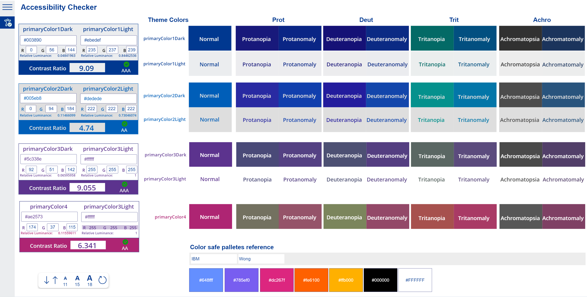

# Color Functions

## Summary

Functions that calculate the contrast between two colors and simulate colors for people with differnt types of color blindness.  

The following image shows a sample implementation of Color Functions component to create a color contrast checker when added to Power App:


The new Color Blind Color Checker page converts a color to simulate different types of color blindness allowing you to see what your users see


Example Accessibility Checker dashboard using the color-functions:


## Applies to

* Power Apps Canvas app

## Solution

Solution|Author(s)
--------|---------
Color Functions  | [P3N](https://github.com/P3N-101)

## Version history

Version|Date|Comments
-------|----|--------
2.0|Nov 2, 2021|Color Blind Functions


## Compatibility


## Prerequisites

None


## Minimal Path to Awesome

* [Download](./solution/color-functions.msapp) the `.msapp` from the `solution` folder
* Use the `.msapp` file using **File** > **Open** > **Browse** within Power Apps Studio.

## Using the Source Code

You can also use the [Power Apps Source Code tool](https://github.com/microsoft/PowerApps-Language-Tooling) to the code using these steps:

* Clone the repository to a local drive
* Pack the source files back into `.msapp` file:
  * [Power Apps Tooling Usage](https://github.com/microsoft/PowerApps-Language-Tooling)
* Use the `.msapp` file using **File** > **Open** > **Browse** in Power Apps Studio.

## Functions

Functions that perform operations on colors

* [sRGBtoLIn](#sRGBtoLIn)
* [getLuminance](#getLuminance)
* [chkContrast](#IsCurrency)
* [ProtanopiaColor](#ProtanopiaColor)
* [ProtanomalyColor](#ProtanomalyColor)
* [DeuteranopiaColor](#DeuteranopiaColor)
* [DeuteranomalyColor](#DeuteranomalyColor)
* [TritanopiaColor](#TritanopiaColor)
* [TritanomalyColor](#TritanomalyColor)
* [AchromatopsiaColor](#AchromatopsiaColor)
* [AchromatomalyColor](#AchromatomalyColor)


### sRGBtoLIn

Linearizes an R G or B value,using the following formula:

```Excel
If(
    Sum(colorChannel / 255) <= 0.03928,
    Sum(colorChannel / 255) / 12.92,
    Power(
        ((Sum(colorChannel / 255) + 0.055) / 1.055),
        2.4
    )
)
```

#### Syntax

```excel
sRGB(colorChannel)
```

Parameter | Description|Required | Type
---|---|---|---
`colorChannel` | Linearizes an R G or B value |Yes | Number

#### Output

* Number

### getLuminance

Calculates the relative luminance of linearized RGB colors using the following formula:

```excel
Sum(
    ('color-functions'.sRGBtoLIN(R) * 0.2126) + 
    ('color-functions'.sRGBtoLIN(G) * 0.7152) + 
    ('color-functions'.sRGBtoLIN(B) * 0.0722)
)
```

#### Syntax

```excel
getLuminance(R,G,B)
```

Parameter | Description|Required | Type
---|---|---|---
`R` | Linearized R Value |Yes | Number
`G` | Linearized G Value |Yes | Number
`B` | Linearized B Value |Yes | Number

#### Output

* Number between 0 and 1

### chkContrast

Calculates the contrast between two colors using the following formula:

```excel
If(
    // Check which Value is higher, calculation then is (darkColor+0.05) / (lightColor+0.05)
    LightColor >DarkColor,
    Text(
        Sum((LightColor + 0.05) / (DarkColor + 0.05)),
        "[$-en-GB]#.000"
    ),
    Text(
        Sum((DarkColor + 0.05) / (LightColor + 0.05)),
        "[$-en-GB]#.000"
    )
)
```

#### Syntax

```excel
chkContrast(DarkColor,LightColor)
```

Parameter | Description|Required | Type
---|---|---|---
`DarkColor` | Dark color relative luminance |Yes | Number
`LightColor` | Light color relative luminance |Yes | Number

#### Output

* Number between 1 and 21

### ProtanopiaColor

Takes R G and B values and simulates __Protanopia__ color-blindness and returns the RGBA value:

```excel
// Return Protanopia RGB Color 
RGBA(
      (R * 56.667 / 100.0 + G * 43.333 / 100.0 + B * 0 / 100.0),
      (R * 55.833 / 100.0 + G * 44.167 / 100.0 + B * 0 / 100.0),
      (R * 0 / 100.0 + G * 24.167 / 100.0 + B * 75.833 / 100.0),1
  )
/*
Protanopia: 
R:[56.667, 43.333,      0]
G:[55.833, 44.167,      0]
B:[     0, 24.167, 75.833]

*/
```

#### Syntax

```excel
ProtanopiaColor(R,G,B)
```

Parameter | Description|Required | Type
---|---|---|---
`R` |  R Value |Yes | Number
`G` |  G Value |Yes | Number
`B` |  B Value |Yes | Number

#### Output

* Color

### ProtanomalyColor

Takes R G and B values and simulates __Protanomaly__ color-blindness and returns the RGBA value:

```excel
// Return Protanomaly RGB Color 
RGBA(
      (R * 81.667 / 100.0 + G * 18.333 / 100.0 + B * 0 / 100.0),
      (R * 33.333 / 100.0 + G * 66.667 / 100.0 + B * 0 / 100.0),
      (R * 0 / 100.0 + G * 12.5 / 100.0 + B * 87.5 / 100.0),1
  )

/*
Protanomaly:  
R:[81.667, 18.333,    0]
G:[33.333, 66.667,    0]
B:[     0    12.5, 87.5]

*/
```

#### Syntax

```excel
ProtanomalyColor(R,G,B)
```

Parameter | Description|Required | Type
---|---|---|---
`R` |  R Value |Yes | Number
`G` |  G Value |Yes | Number
`B` |  B Value |Yes | Number

#### Output

* Color

### DeuteranopiaColor

Takes R G and B values and simulates __Deuteranopia__ color-blindness and returns the RGBA value:

```excel
// Return Deuteranopia RGB Color 
RGBA(
      (R * 62.5 / 100.0 + G * 37.5 / 100.0 + B * 0 / 100.0),
      (R * 70 / 100.0 + G * 30 / 100.0 + B * 0 / 100.0),
      (R * 0 / 100.0 + G * 30 / 100.0 + B * 70 / 100.0),1
  )

/*

 Deuteranopia: 
    R:[62.5, 37.5,  0]
    G:[70,   30,    0]
    B: [0,   30,   70]
*/
```

#### Syntax

```excel
DeuteranopiaColor(R,G,B)
```

Parameter | Description|Required | Type
---|---|---|---
`R` |  R Value |Yes | Number
`G` |  G Value |Yes | Number
`B` |  B Value |Yes | Number

#### Output

* Color

### DeuteranomalyColor

Takes R G and B values and simulates __Deuteranomaly__ color-blindness and returns the RGBA value:

```excel
// Return Deuteranomaly RGB Color 
RGBA(
      (R * 80 / 100.0 + G * 20 / 100.0 + B * 0 / 100.0),
      (R * 25.833 / 100.0 + G * 74.167 / 100.0 + B * 0 / 100.0),
      (R * 0 / 100.0 + G * 14.167 / 100.0 + B * 85.833 / 100.0),1
  )

/*
Deuteranomaly:
R:[80,     20,      0]
G:[25.833, 74.167,  0]
B: [0,     14.167, 85.833]
*/
```

#### Syntax

```excel
DeuteranomalyColor(R,G,B)
```

Parameter | Description|Required | Type
---|---|---|---
`R` |  R Value |Yes | Number
`G` |  G Value |Yes | Number
`B` |  B Value |Yes | Number

#### Output

* Color


### TritanopiaColor

Takes R G and B values and simulates __Tritanopia__ color-blindness and returns the RGBA value:

```excel
// Return Tritanopia RGB Color 
RGBA(
      (R * 95 / 100.0 + G * 5 / 100.0 + B * 0 / 100.0),
      (R * 0 / 100.0 + G * 43.333 / 100.0 + B * 56.667 / 100.0),
      (R * 0 / 100.0 + G * 47.5 / 100.0 + B * 52.5 / 100.0),1
  )
/*
Tritanopia:   {
R:[95,  5,      0],
G: [0, 43.333, 56.667],
B: [0, 47.5,   52.5]
*/
```

#### Syntax

```excel
TritanopiaColor(R,G,B)
```

Parameter | Description|Required | Type
---|---|---|---
`R` |  R Value |Yes | Number
`G` |  G Value |Yes | Number
`B` |  B Value |Yes | Number

#### Output

* Color

### TritanomalyColor

Takes R G and B values and simulates __Tritanomaly__ color-blindness and returns the RGBA value:

```excel
// Return Tritanomaly RGB Color 
RGBA(
      (R * 96.667 / 100.0 + G * 3.333 / 100.0 + B * 0 / 100.0),
      (R * 0 / 100.0 + G * 73.333 / 100.0 + B * 26.667 / 100.0),
      (R * 0 / 100.0 + G * 18.333 / 100.0 + B * 81.667 / 100.0),1
  )
/*
Tritanomaly:  {
R:[96.667, 3.333,   0],
G: [0,     73.333, 26.667],
B: [0,     18.333, 81.667]
*/
```

#### Syntax

```excel
TritanomalyColor(R,G,B)
```

Parameter | Description|Required | Type
---|---|---|---
`R` |  R Value |Yes | Number
`G` |  G Value |Yes | Number
`B` |  B Value |Yes | Number

#### Output

* Color

### AchromatopsiaColor

Takes R G and B values and simulates __Achromatopsia__ color-blindness and returns the RGBA value:

```excel
// Return Achromatopsia RGB Color 
RGBA(
      (R * 29.9 / 100.0 + G * 58.7 / 100.0 + B * 11.4 / 100.0),
      (R * 29.9 / 100.0 + G * 58.7 / 100.0 + B * 11.4 / 100.0),
      (R * 29.9 / 100.0 + G * 58.7 / 100.0 + B * 11.4 / 100.0),1
  )
/*
Achromatopsia:
R:[29.9, 58.7, 11.4]
G:[29.9, 58.7, 11.4]
B:[29.9, 58.7, 11.4]
    */
```

#### Syntax

```excel
AchromatopsiaColor(R,G,B)
```

Parameter | Description|Required | Type
---|---|---|---
`R` |  R Value |Yes | Number
`G` |  G Value |Yes | Number
`B` |  B Value |Yes | Number

#### Output

* Color

### AchromatomalyColor

Takes R G and B values and simulates __Achromatomaly__ color-blindness and returns the RGBA value:

```excel
// Return Achromatomaly RGB Color 
RRGBA(
      (R * 61.8 / 100.0 + G * 32 / 100.0 + B * 6.2 / 100.0),
      (R * 16.3 / 100.0 + G * 77.5 / 100.0 + B * 6.2 / 100.0),
      (R * 16.3 / 100.0 + G * 32.0 / 100.0 + B * 51.6 / 100.0),1
  )
/*
Achromatomaly:
R:[61.8, 32,    6.2]
G:[16.3, 77.5,  6.2]
B:[16.3, 32.0, 51.6]
*/
```

#### Syntax

```excel
AchromatomalyColor(R,G,B)
```

Parameter | Description|Required | Type
---|---|---|---
`R` |  R Value |Yes | Number
`G` |  G Value |Yes | Number
`B` |  B Value |Yes | Number

#### Output

* Color

## Disclaimer

*THIS CODE IS PROVIDED *AS IS* WITHOUT WARRANTY OF ANY KIND, EITHER EXPRESS OR IMPLIED, INCLUDING ANY IMPLIED WARRANTIES OF FITNESS FOR A PARTICULAR PURPOSE, MERCHANTABILITY, OR NON_INFRINGEMENT.*
